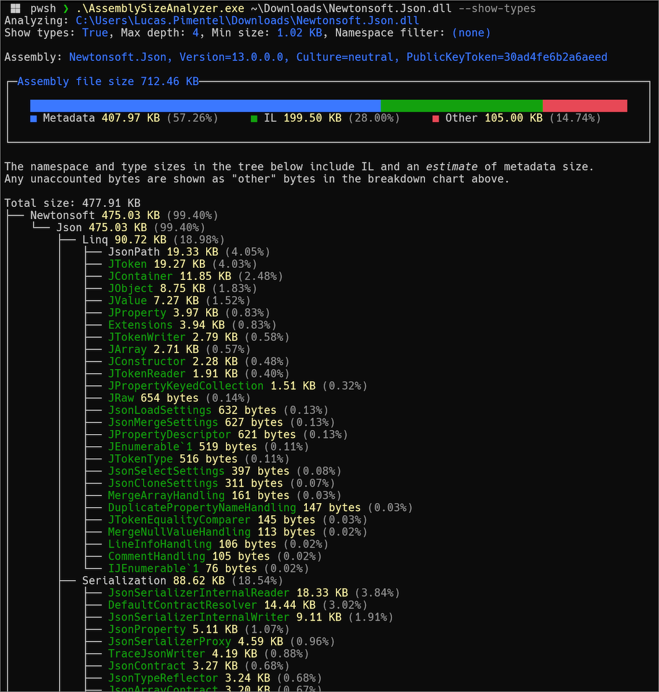

A cross-platform command-line tool that analyzes the contents of a .NET assembly file, estimates the file size in bytes used by each type, and shows the results as a tree, grouped by namespace.

Based on **Sizer.Net**, a WinForms tool which targets .NET Framework 4.5: https://github.com/schellingb/sizer-net.

For a version of **Sizer.Net** that targets .NET 9, see fork: https://github.com/lucaspimentel/sizer-net.

Screenshot:

