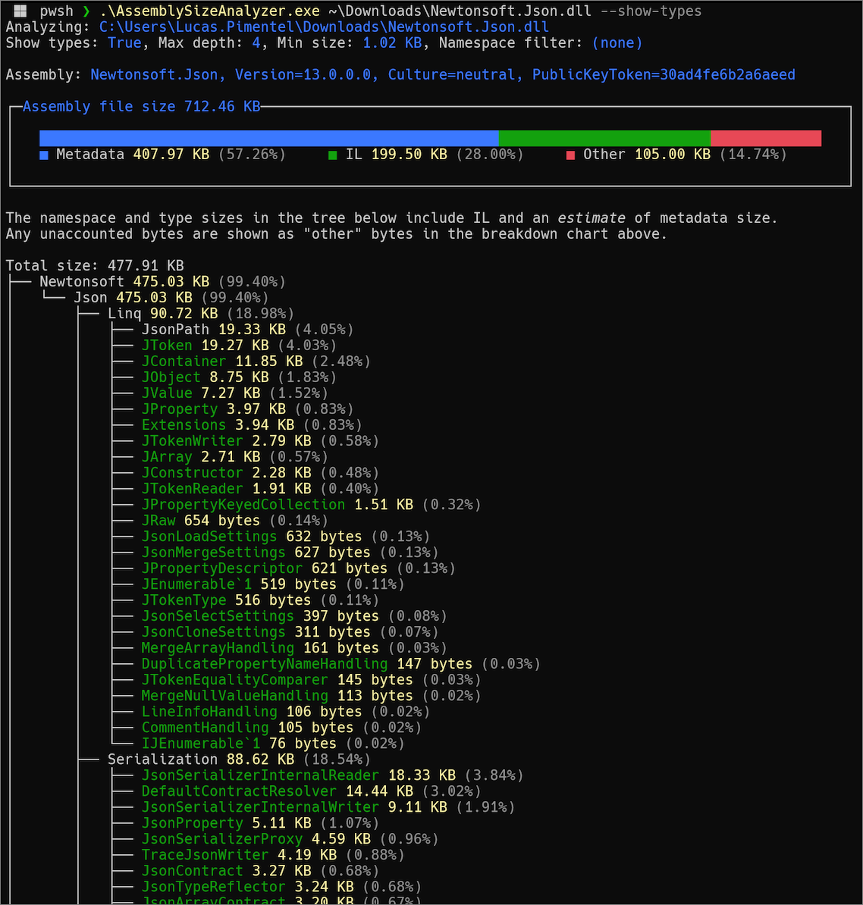

A cross-platform command-line tool that analyzes the contents of a .NET assembly file, estimates the file size in bytes used by each type, and shows the results as a tree, grouped by namespace.

Based on **Sizer.Net**, a WinForms tool which targets .NET Framework 4.5: https://github.com/schellingb/sizer-net.

For a version of **Sizer.Net** that targets .NET 9, see fork: https://github.com/lucaspimentel/sizer-net.

## Installation

### Scoop (Windows)

```powershell
scoop bucket add lucaspimentel https://github.com/lucaspimentel/scoop-bucket
scoop install analyze-assembly-size
```

### From GitHub releases (recommended)

Download and install pre-built binaries for Windows or Linux:

```bash
./install-remote.ps1
```

Or install a specific version:

```bash
./install-remote.ps1 -Version 1.0.0
```

One-liner from GitHub:

```bash
irm https://raw.githubusercontent.com/lucaspimentel/analyze-assembly-size/main/install-remote.ps1 | iex
```

### From source

Requires .NET 10 SDK.

```bash
# Build and install to ~/.local/bin
./install-local.ps1

# Or build manually
dotnet build src/AssemblySizeAnalyzer.csproj
dotnet publish src/AssemblySizeAnalyzer.csproj -c Release
```

## Usage

```bash
# Run with a path to an assembly
analyze-assembly-size <path-to-assembly>

# Or if not in PATH, run the local script
dotnet run --project src/AssemblySizeAnalyzer.csproj -- <path-to-assembly>
```

### Options

| Option | Description | Default |
|---|---|---|
| `--show-types` | Display individual types within namespaces | `false` |
| `--max-depth N` | Maximum tree depth | `4` |
| `--min-size N` | Minimum size in bytes to display | `1000` |
| `--namespace NS` | Filter to specific namespace and children | |
| `--size-units UNIT` | Display units: `auto`, `mb`, `kb`, `b` | `auto` |
| `--json` | Output results as JSON only | `false` |

## Screenshot



## License

This project is licensed under the [MIT License](LICENSE).